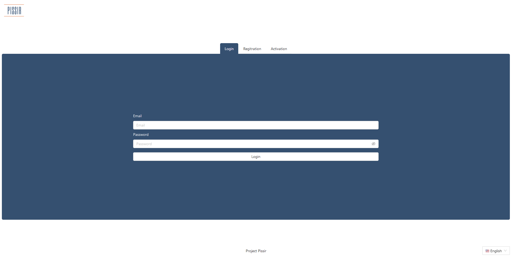
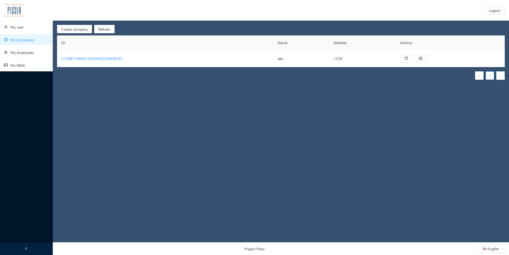

# Project PISSIR 2021/2022

## Introduction
This project has been developed at the University of Eastern Piedmont during the course of "Progettazione e Implementazione di Sistemi Software In Rete" (PISSIR) with the collaboration of [LukeAz](https://github.com/LukeAz). The project is a management platform for farms that wants to monitor the status of their fields and greenhouses.

*Login page*

*Home*

## General info
All the informations regarding the development phase and how to launch the application and the unit test can be found in the report.

🇮🇹 [Report in italian language](https://github.com/DaveDeDave/ProjectPissir/tree/main/report/it)
🇬🇧 [Report in english language](https://github.com/DaveDeDave/ProjectPissir/tree/main/report/en)

## Used technologies
      

- Node.js
- Fastify
- Yarn workspaces (monorepo)
- MariaDB
- Docker
- Nginx
- Vue.js
- Ant Design
- MQTT
- Mocha and supertest