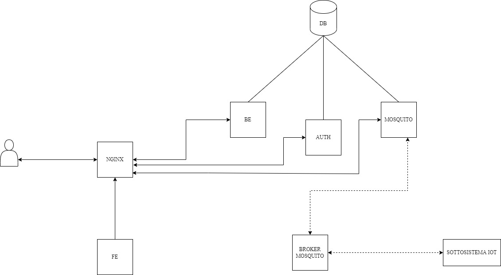
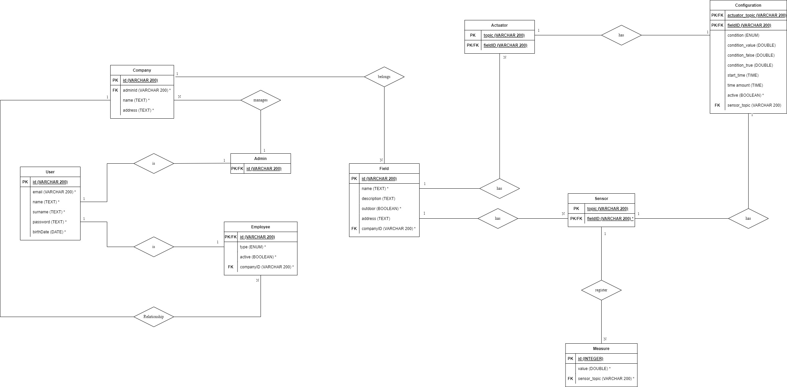

Davide Ceci - Matricola 20033793
Luca Tamone - Matricola 20034235 
Progettazione e implementazione di sistemi software in rete

# Report Project Pissir 2021/2022

## Introduction
The purpose of this report is to illustrate the development and the working of an outdoor/indoor greenhouses management system.

## Requirements

*Figure 1 Use case diagram*
 
The application will include three kind of users:
- **Admin**
- **Farmer**
- **Collaborator**

The administrator is the only kind of user that can be registered within the application. Once an administrator has been registered, he will be able to create his companies, farmers and collaborators (from now, we will call employees the last two), and his greenhouses/fields.

Employees must be associated with a company at the time of creation and they will only be able to view the greenhouses of their company. In particular, the farmer will be able to manage every aspect of the greenhouse (creation, modification, elimination, display), while the collaborator can only view it.

In addition, once an employee has been created, a temporary password will be provieded to be used to activate the relevant user

Inside a greenhouse there will be sensors and actuators. The sensors will communicate the measurements taken and the actuators will change status, either based on a configuration (based on the values received from the sensors or based on a certain time interval) or manually. All users of the application will be able to manage every aspect of the sensors and actuators (insertion, deletion, display).

## Architecture design

The application will be divided into microservices, and each of them will run within its own docker container and will be developed in node.js. This gives our application the possibility to be deployed ideally on any machine/environment, wheter local or in the cloud, and guarantess scalability as each microservice will manage its own resources.

The application will expose REST API that will be divided into three microservices (developed with fastify framework):
- **Backend**: it will contain all the main APIs not contained in the other two microservices.
- **Autenticazione**: external authentication system.
- **Mosquito**: it will allow to receive and send messages from mqtt topics and it will manage everything related to sensors and actuators (recording sensor values on db and publishing configurations on actuators).

There will be other containers that will complete the operation of the application:
- **Database**: it will be used a mariadb container.
- **Simulator**: it will simulate a possible IoT subsystem. In particular, there will be sensors that will periodically send values, and actuators that will maintain a volatile state.
- **Nginx**: it will expose the frontend of the application and i will connect the various endpoints of the microservices.
- **Broker mqtt**: it will be used to connect the IoT system and the various microservices.

*Figure 2 Architecture*

*Figure 3 Entity-Relationship Model*
 
The REST API schemes have been written using Swagger. This had two advantages:
- It has a nice and clear UI to consult the documentation.
- It can be directly integrated into fastify in the next development phase to validate the requests/responses.

The mqtt messages will mainly split into these three patterns
- `pissir/:idSerra/actuator/:actuatorTopic` - this topic will be used to send commands from the mosquito microservice to the IoT subsystem (which will change the status of the actuator).
- `pissir/:idSerra/sensor/:sensorTopic` - this topic will be used to receive the values recorded by the sensors.
- `pissir/:idSerra/actuator/:actuatorTopic/getState` – this topic will be used to request the actuator to communicate its status.

In all topics, `:idSerra` represents the greenhouse id saved in the database, while `:idSerra` and `:sensorTopic` represent the name associated with each group of sensors/actuators.

For example, if we subscribe to the topic `pissir/+/sensor/#` (using these wildcards), we would receive all the values recorded by all the sensors of any greenhouse.

## Launch instructions

The only prerequisite to start the application is to have the docker application installed on your computer. You can run the `docker-commands-linux` file to deploy in the specified environment (`.sh` for linux systems, `.bat` for windows systems)

Commands list:
- `docker-commands-linux.sh docker:start:prod` - deploy production containers
- `docker-commands-linux.sh docker:stop:prod` - stop production containers
- `docker-commands-linux.sh docker:start:dev` - deploy development containers
- `docker-commands-linux.sh docker:stop:dev` – stop production containers
- `docker-commands-linux.sh docker:start:test` – deploy mariadb volume for unit tests
- `docker-commands-linux.sh docker:stop:test` – stop mariadb volume for unit tests
- `docker-commands-linux.sh docker:cleanup` – deletes all the containers and volumes

Alternatively, you can install yarn on your computer and run the same commands from the root of the project by typing `yarn <command-name>`

To launch tests, where present, you must start the test docker volume and from the root of the project run the command `yarn workspace <package_name> test` (e.g. `yarn workspace @pissir/be test`) and you must have node.js and yarn installed.

The packages are the following:
- @pissir/be
- @pissir/auth
- @pissir/mosquito
- @pissir/lib
- @pissir/simulator (only for development environment)
- @pissir/fe

Each package corresponds to a microservice, with the exception of `@pissir/lib`, which is used to contain functions and utility libraries.

In development and production environment, the database will not be deleted when containers are deleted. To delete the databse, the cleanup command must be performed.

You should start the application in development environment (command `docker:start:dev`) in order to see the documentation at the following endpoints:
- /v1/docs – for backend microservice
- /v1/auth/docs – for authentication microservice (backend)
- /v1/mosquito/docs – for mosquito microservice (backend)

## Troubleshooting

On windows it may happend that a system service blocks certain ports and so it is impossible to start the containers. A possible solution is to run the `net stop winnat` command.

On linux you may not be able to launch the .sh file to start containers. To fix this just run the command `chmod +x <nomefile.sh>`.

## Test

All the REST APIs have been tested using mocha and supertest. Testing of the IoT system has been done using a simulator written in node.js. The simulator simply sends sensor data and reveive actuator commands, and represents an IoT subsystem.
