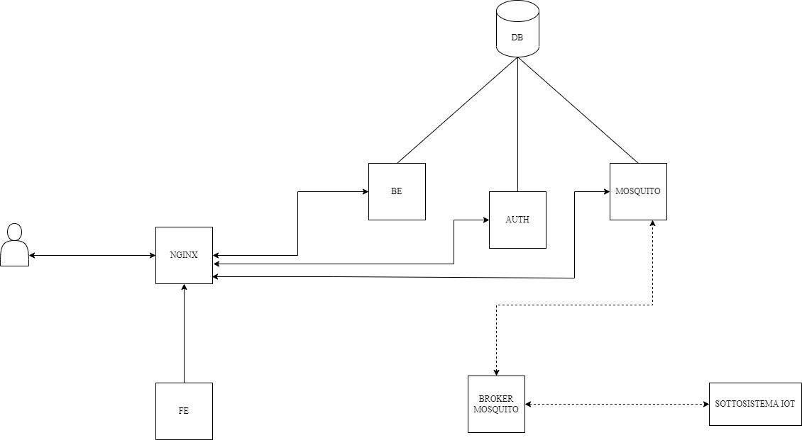
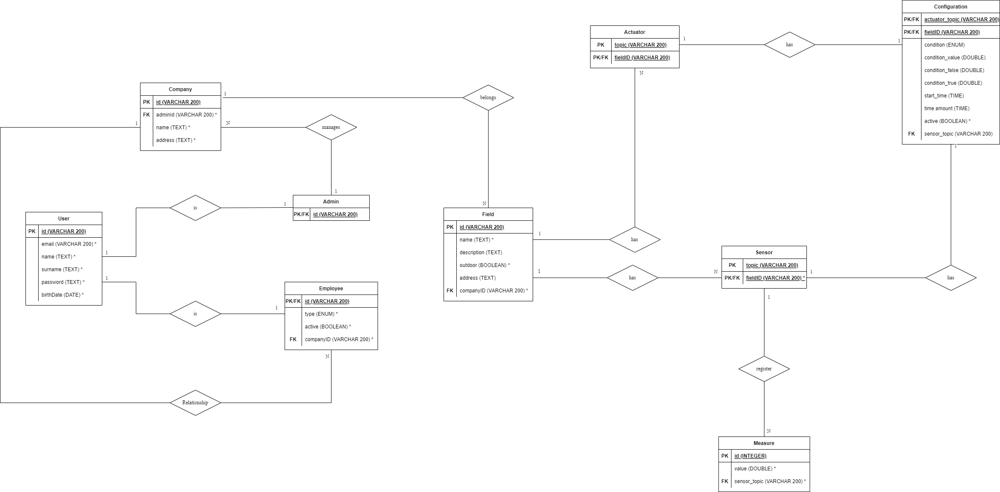

Davide Ceci - Matricola 20033793
Luca Tamone - Matricola 20034235 
Progettazione e implementazione di sistemi software in rete

# Relazione Progetto Pissir 2021/2022

## Introduzione
Lo scopo di questa relazione è quella di illustrare lo sviluppo e il funzionamento di un sistema di gestione di coltivazioni di ortaggi / fiori all’aperto o in serra.

## Specifica

*Figura 1 Diagramma dei casi d'uso*
 
L’applicazione prevederà tre tipi di utenti:
- **Amministratore**
- **Agricoltore**
- **Collaboratore**

L’amministratore è l’unico tipo di utente di cui si può effettuare la registrazione all’interno dell’applicazione. Una volta registrato un amministratore, esso potrà creare le sue aziende, gli agricoltori e i collaboratori (che chiameremo impiegati) e le sue serre.

Gli impiegati dovranno essere associati ad un’azienda al momento della creazione e potranno visualizzare solo le serre della loro azienda. In particolare, l’agricoltore potrà gestire ogni aspetto della serra (creazione, modifica, eliminazione, visualizzazione), mentre il collaboratore potrà solo visualizzarla.

Inoltre, una volta creato un impiegato verrà fornita una password temporanea da utilizzare per attivare il relativo utente.

All’interno di una serra saranno presenti dei sensori e degli attuatori. I sensori comunicheranno le misure rilevate e gli attuatori cambieranno stato, o in base ad una configurazione (in base ai valori ricevuti dai sensori o in base ad un certo intervallo di tempo) o manualmente. Tutti gli utenti dell’applicazione potranno gestire ogni aspetto dei sensori e degli attuatori (inserimento, cancellazione, visualizzazione di opportuni valori).

## Progettazione

L’applicazione sarà divisa in microservizi, e ciascuno di essi girerà all’interno del proprio container docker e saranno sviluppati in node.js. Questo dà la possibilità alla nostra applicazione di essere lanciata idealmente su qualsiasi macchina/ambiente, che sia locale che in cloud, e garantisce scalabilità in quanto ogni microservizio gestirà le proprie risorse.

L’applicazione esporrà delle API di tipo REST che saranno divise in tre microservizi (sviluppate con il framework fastify):
- **Backend**: conterrà tutte le principali api non contenute negli altri due microservizi.
- **Autenticazione**: sistema di autenticazione esterno.
- **Mosquito**: permetterà di ricevere e inviare i messagi dai topic mqtt e gestirà tutto ciò che riguarda i sensori e gli attuatori (registrazione valori dei sensori su db e publish delle configurazioni sugli attuatori).

Saranno presenti altri container che andranno a completare il funzionamento dell’applicazione:
- **Database**: utilizzeremo un container di mariadb.
- **Simulatore**: andrà a simulare un possibile sottosistema IoT. In particolare, saranno presenti dei sensori che invieranno periodicamente dei valori, e degli attuatori che manterranno uno stato volatile.
- **Nginx**: Andrà ad esporre il frontend dell’applicazione e a collegare i vari endpoint dei microservizi.
- **Broker mqtt**: servirà per mettere in comunicazione il sistema IoT e i vari microservizi.

*Figura 2 Architettura*

*Figura 3 Modello E-R*
 
Gli schemi delle API REST sono stati sviluppati utilizzando Swagger (trovabili nella cartella docs in formato pdf). Questo presenta due vantaggi:
- Si ha una gradevole e chiara UI per consultare la documentazione.
- È direttamente integrabile in fastify nella fase successiva di implementazione per effettuare la validation delle request/response.

I messaggi mqtt si divideranno principalmente in questi due pattern:
- `pissir/:idSerra/actuator/:actuatorTopic` - questo topic verrà utilizzato per inviare i comandi dal microservizio di mosquito al sottosistema IoT (che andrà poi a cambiare lo stato dell’attuatore).
- `pissir/:idSerra/sensor/:sensorTopic` - questo topic verrà utilizzato per ricevere i valori registrati dai sensori.
- `pissir/:idSerra/actuator/:actuatorTopic/getState` – questo topic verrà usato per richiedere all’attuatore di comunicare il suo stato.

In tutti e due i topic, `:idSerra` rappresenta l’id della serra salvato a database, mentre `:actuatorTopic` e `:sensorTopic` rappresentano il nome associato a ciascun gruppo di sensori/attuatori.

Per esempio, se facessimo la subscribe al topic `pissir/+/sensor/#` (sfruttando queste wildcard), riceveremmo tutti i valori registrati da tutti i sensori di qualsiasi serra.

## Indicazioni avvio

L’unico prerequisito per avviare l’applicazione è di avere installato sul proprio computer l’applicativo Docker. In seguito, si potrà lanciare il file `docker-commands-linux` per avviare nella modalità specificata (fare riferimento al `.sh` per sistemi linux e al `.bat` per sistemi windows).

Elenco comandi:
- `docker-commands-linux.sh docker:start:prod` - avvio containers in production
- `docker-commands-linux.sh docker:stop:prod` - stop containers in production
- `docker-commands-linux.sh docker:start:dev` - avvio containers in development
- `docker-commands-linux.sh docker:stop:dev` – stop containers in development
- `docker-commands-linux.sh docker:start:test` – avvio volume di maria db per i test
- `docker-commands-linux.sh docker:stop:test` – stop volume di maria db per i test
- `docker-commands-linux.sh docker:cleanup` – cleanup di tutti i container e volume (cancella tutto)

Alternativamente, si può installare yarn sul proprio computer e lanciare gli stessi comandi dalla root del progetto digitando `yarn <nome-comando>`.

Per lanciare i test, dove presenti, bisogna avviare il docker di test e dalla root del progetto lanciare il comando `yarn workspace <nome_package> test` (ad esempio “yarn workspace @pissir/be test”) e bisogna avere installato node.js e yarn.

I package sono i seguenti:
- @pissir/be
- @pissir/auth
- @pissir/mosquito
- @pissir/lib
- @pissir/simulator (solo per la modalità Development)
- @pissir/fe

Ogni package corrisponde ad un microservizio, ad eccezione di `@pissir/lib`, che serve a contenere funzioni e librerie di utility.

In modalità development e production, il database non verrà eliminato quando i container verranno eliminati. Per eliminare il database è necessario effettuare il comando di cleanup.

È consigliabile avviare l’applicazione in ambiente development (comando `docker:start:dev`) in modo da poter vedere anche la documentazione ai seguenti endpoint:
- /v1/docs – per il microservizio del backend
- /v1/auth/docs – per il microservizio dell’autenticazione (backend)
- /v1/mosquito/docs – per il microservizio di mosquito (backend)

## Troubleshooting

Su windows può capitare che un servizio di sistema blocchi certe porte e quindi sia impossibile avviare i container. Una possibile soluzione è lanciare il comando `net stop winnat`.

Su linux potrebbe non essere lanciabile il file .sh per avviare i container. Per risolvere basta lanciare il comando `chmod +x <nomefile.sh>`.

## Test

Sono state testate tutte le API REST utilizzando mocha e supertest. Il test del sistema IoT è stato effettuato tramite un simulatore scritto in node.js. Il simulatore non fa altro che inviare i dati dei sensori e ricevere i comandi degli attuatori, e rappresenta un sottosistema IoT 
